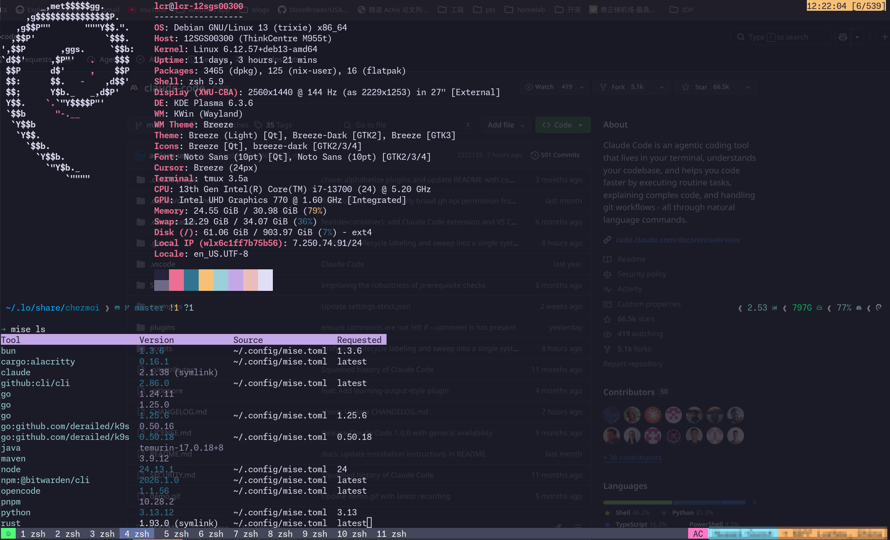

# WAAAGH's linux dev env

## Whats in this repo

- [x] DE: [kde plasma](https://kde.org/) configs
- [x] Shell prompt: [starship](https://starship.rs/) configs
- [x] Terminal: [alacritty](https://starship.rs/) configs
- [x] Personal secret: [bitwarden](https://bitwarden.com/help/cli/)
- [x] Terminal enhance: [tmux](https://github.com/tmux/tmux) configs
- [x] Font: set monospace font to [monaspace](https://monaspace.githubnext.com/)
- [x] Tools: [dev tools](./dotfiles/dot_config/mise.toml) managed by [mise](https://mise.jdx.dev/) such as: [opencode](https://opencode.ai), [uv](https://docs.astral.sh/uv/) and [claude code](https://github.com/anthropics/claude-code)
- [x] Dotfile management: [chezmoi](chezmoi.io/reference/special-directories/chezmoiscripts/)


## SCREENSHOT



## HOW TO INSTALL

### Quick start

- Install `git` and `fontconfig` which are used in the process below

for debian/ubuntu user
```bash
apt install git fontconfig zsh curl
```

- Install [chezmoi](https://www.chezmoi.io/install/)

```bash
sh -c "$(curl -fsLS get.chezmoi.io)" -- -b $HOME/.local/bin
```

- To install latest [alacritty](https://github.com/alacritty/alacritty) terminal, install build deps from [this guide](https://github.com/alacritty/alacritty/blob/master/INSTALL.md)

- Then initialize and apply the configuration:

```bash
chezmoi init pkking
chezmoi apply
```

~~Install tmux plugins by pressing `Ctrl + a` and `Shift+i`~~

Now all `tmux plugins` will be installed on a new machine due to [this tip](https://github.com/tmux-plugins/tpm/blob/master/docs/automatic_tpm_installation.md)

### handle sensitive data

- Encrypt a file with sensitive data

```bash
chezmoi add --encrypt <path to file>
```

- Re-encrypt all files when add a new public key
```bash
chezmoid re-add --encrypt
```

feel free to email me or commit a issue

have fun :)
